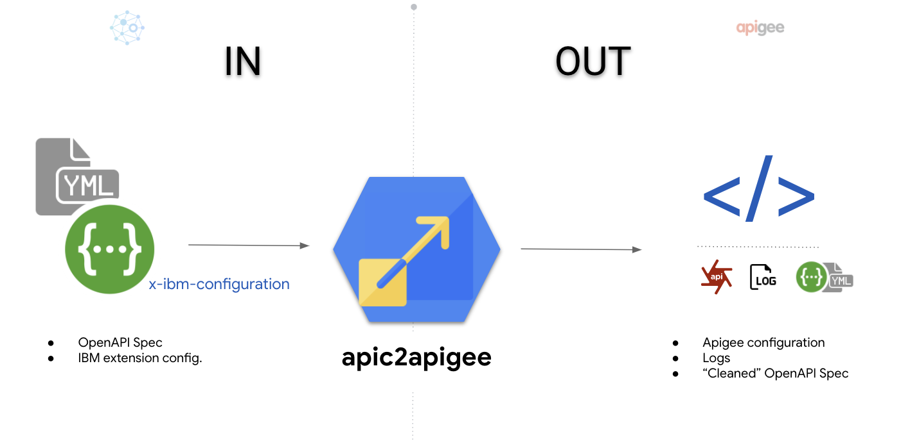
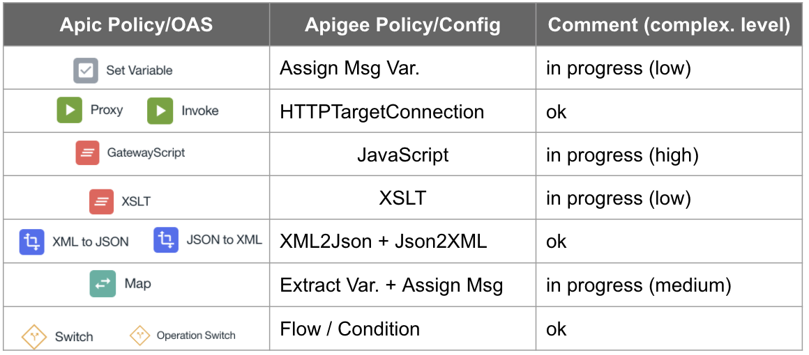
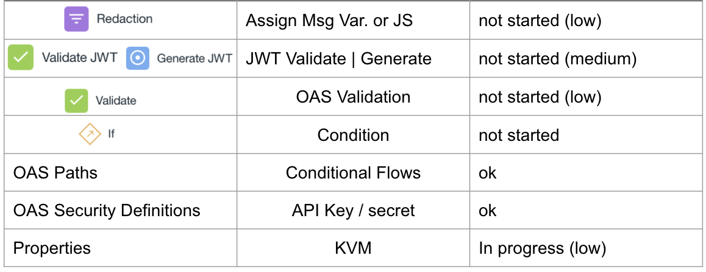
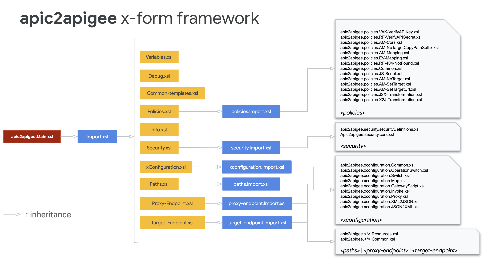

# apic2apigee

## Versions

0.1.0 : May 2020 - initial version of **apic2apigee**

## Introduction

**apic2apigee** is a migration tool used to transform an APIC OpenAPI Specification into an Apigee API Proxy configuration.

Here is a picture presenting the migration that is operated by **apic2apigee**:



**apic2apigee** is based on a set of XSLT files that are used to operate the transformation of 'x-ibm-configuration' extension into Apigee technical artifacts:

- policies
- proxy endpoint configuration
- target endpoint configuration
- resources

Paths, cors, security definitions... are also adapted into Apigee configuration artifacts.

## Quickstart

Here is a quickstart if you want to migrate an APIC OpenAPI Specification into an Apigee API Proxy configuration:

1. Clone the **apic2apigee** repository 

2. Get the OpenAPI Specification into a JSON format
    
    If you need to transform the YAML content of the spec into JSON, here is an online tool you can use: https://onlinejsontools.com/convert-yaml-to-json

3. Once you have got your APIC OpenAPI Specification in JSON format, use the following command to transform the OpenAPI Specification (JSON) into XML:

    ```
    $> curl -k -H "Accept:text/xml" \
            -H "Content-Type: application/json" \
            https://emea-poc8-test.apigee.net/v1/json2xml \
            --data-binary @<your_apic_spec_file.json> \
            > <your_apic_spec_file>.xml
    ```
    ...where **<your_apic_spec_file>** is the file name of your APIC OpenAPI Specification

    If you want, you can also install the API Proxy, similar to the one expose on the **/v1/json2xml** base bath and operate the JSON to XML transformation with your own proxy.
    The JSON2XML API Proxy configuration is provided in this github repo (cf. [json2xml](./json2xml) directory)

4. At this step of the migration process, you have got an APIC OpenAPI Specification based on a well-formed XML document. You are going to use this document in order to generate the Apigee configuration.

    The **apic2apigee** transformation framework is based on XSL Transformation files.
    The version of XSLT that is used is **XSLT-3.0**.
    In order to execute XSLT, you can use [Saxon HE](http://saxon.sourceforge.net/), a powerful XSLT-3.0 processor

    At this step, you can download and install **Saxon HE** (Home Edition) or use a docker image, which provides the Saxon XSL processor.

    If you use the [docker image of **Saxon HE**](https://hub.docker.com/r/klakegg/saxon), here is the command you can use to execute the apic2apigee migration (from the root of the **apic2apigee** git repository):

    ```
    $> docker run --rm -i \
        -u $(id -u) \
        -v $(pwd):/src \
        klakegg/saxon \
        xslt -s:<your_apic_spec_file>.xml -xsl:./apic2apigee/apic2apigee.Main.xsl
    ```

    If you have installed **Saxon HE** (on your laptop or mac) here is the command you can use (from the root of the **apic2apigee** repository):

    ```
    $> saxon -s:<your_apic_spec_file>.xml -xsl:./apic2apigee/apic2apigee.Main.xsl
    ```

5. As a result, you will get an output directory (**./\_res\_**) that contains 2 sub directories:
    - **apiproxy**, that includes the API Proxy configuration
    - **logs**, that includes the traces of what has been created, provided as an XML document

## Supported migration

Here is a list of the current policies that can be migrated fron API Connect to Apigee:




## XSLT Framework

Here is an overview of the XSLT framework used to migrate an XML representation of an API Connect OpenAPI Specification to an Apigee API Proxy:



XSL stylesheets are organized per themes and the entry point of the migration/transformation framework is **apic2apigee.Main.xsl**

```xsl:import``` is used to provide inheritance mechanism between the different XSLT levels.

Basically, the **apic2apigee** migration consists in:
1. transforming the input document into *pivot* configuration node sets (XML)
2. adapting *pivot* configuration node sets into Apigee API Proxy configuration artifacts

This decoupling gives the ability to adapt the migration tool in order to support future enhancements of Apic extensions in an easy way

## Conclusion

This is pretty much all what you need to know in order to operate the migration of your API Connect OpenAPI Specification into an Apigee API Proxy configuration.
Just test it and tell me if there are some enhancements you would like to see in a future release of **apic2apigee** 

## Future enhancements

In the next release, here are some enhancements that will be provided:

* Key Value Map (KVM) configuration based on properties of the OpenAPI Specification
* Migration of some more Apic policies (If, JWT Validate/Generate...)

